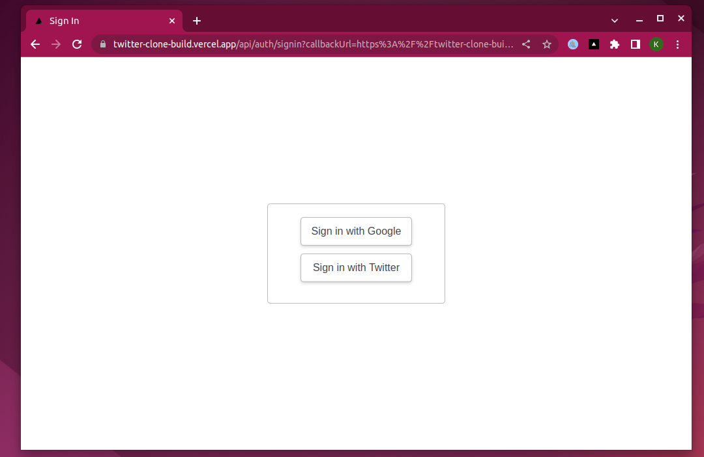
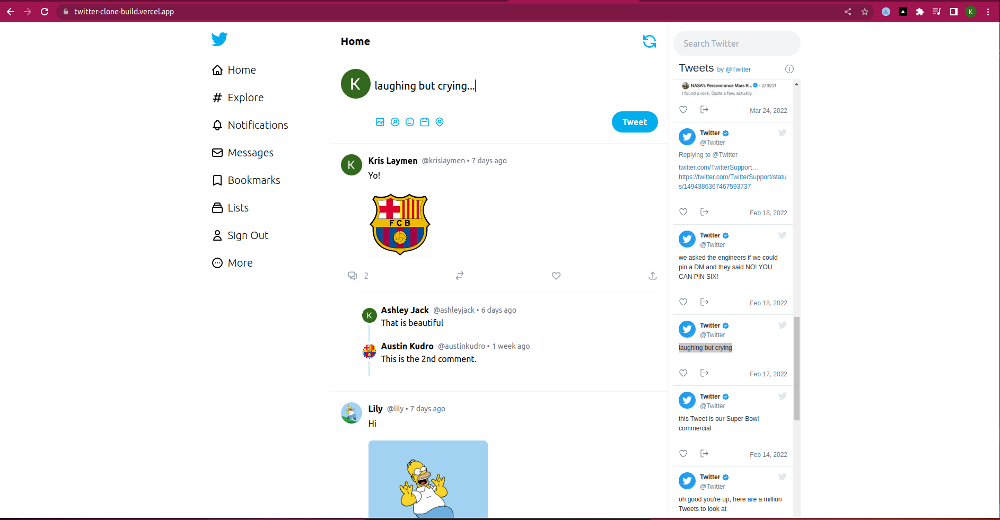
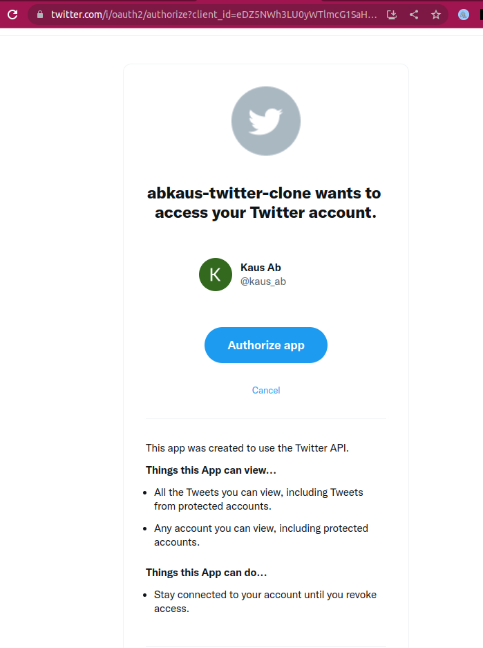
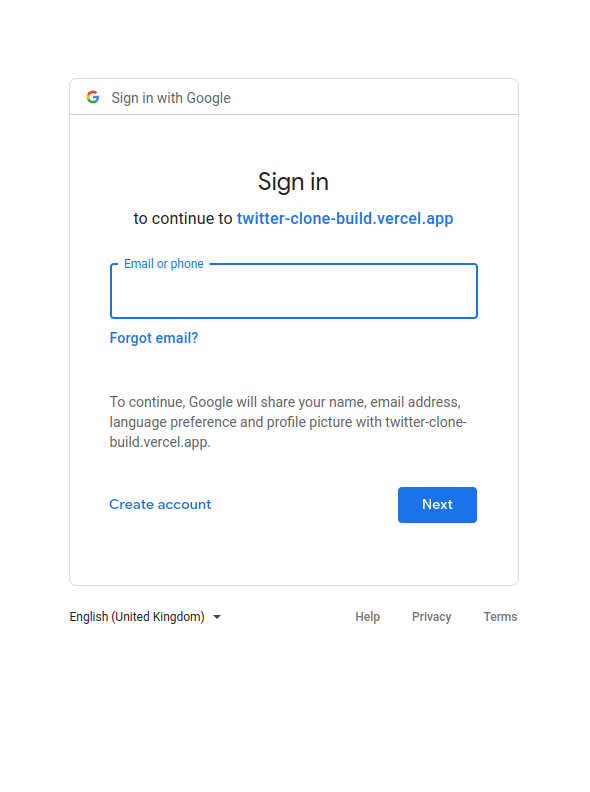

## Twitter build 

Twitter clone is an attempt to understand the development of enterprise grade web application which includes content management, user authentication, and an impressive UI similar to real Twitter application.

- Nextjs React framework.
- Tailwind CSS for responsive UI design
- NextAuth for convenient integration with third party Authentication 
- OAuth 2.0
  - Twitter
  - Google
- Sanity Content Management System to store data related to tweets and comments from the authenticated users.
- Embedded twitter widget to stream real-time tweets from twitter on the side panel within this app
- Keeping user friendly UI by keeping the component sizes and colours consistent

Web url: <https://twitter-clone-build.vercel.app/>

Screenshots:

